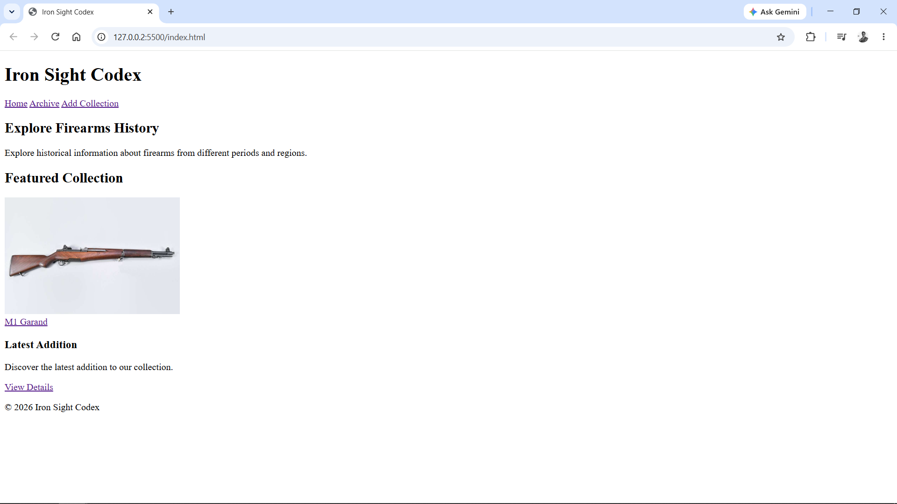
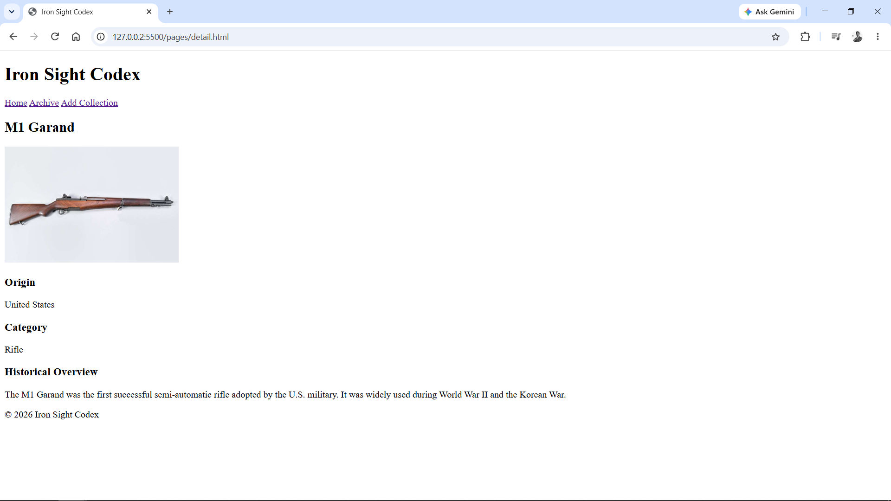
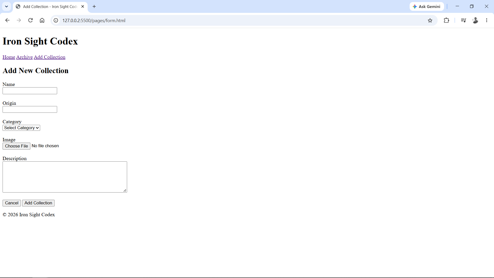

# Iron Sight Codex

> A digital encyclopedia exploring the history, origins, and stories behind firearms.

## About

Iron Sight Codex is a web-based digital encyclopedia that provides
historical information about various firearms, including their origin,
category, images, and historical overview.

This project is developed as part of the Web Programming course and
will be continuously developed throughout the semester.

## Features

- Firearms collection
- Firearm detail pages
- Add collection form
- Historical information
- Accessible HTML structure

## Pages

### Home
The main page displaying the firearms collection.

### Detail
Displays detailed information about a selected firearm.

### Add Collection
A form for adding a new firearm collection.

## Screenshots

### Home

### Firearm Detail

### Add Collection

## Technologies

- HTML5

## Project Status

Currently in development.

This project will be gradually developed with additional technologies
and features throughout the semester.

## Author

Farrel Irham Adzkaar Susanto